# Semantic Segmentation on PASCAL VOC

> [!NOTE]
> Source code is withheld to comply with academic project guidelines at the [**KU Leuven**](https://www.kuleuven.be/english/kuleuven). This repository functions solely as a technical showcase detailing architecture, implementation strategy and results.
>
> This was a group project; the Semantic Segmentation section — code, writeup, and conclusion below — was completed independently by me.

## Table of Contents

1. [Overview](#1-overview)

2. [Train Set Exploration](#2-train-set-exploration)
   * [Image Size](#image-size)
   * [Class Distribution](#class-distribution)
   * [Class Co-occurrence](#class-co-occurrence)

3. [Semantic Segmentation](#3-semantic-segmentation)

    3.1. [Initial DeepLab Model](#31-initial-deeplab-model)
      * [DeepLab Dataset](#deeplab-dataset)
      * [Weights](#weights)
      * [Training](#training)
      * [Prediction](#prediction)
      * [Dataset Loading](#dataset-loading)
      * [Improvement: Model Saving](#improvement-model-saving)
      * [Training Run](#training-run)
      * [Analysis](#analysis)
      * [Stage Plots](#stage-plots)
      * [Overall Analysis](#overall-analysis)
      * [Segmentation Mask Plots](#segmentation-mask-plots)
      * [Analysis](#analysis-1)
    
    3.2. [Improvement: Combo Loss](#32-improvement-combo-loss)
      * [Second Training Run](#second-training-run)
      * [Analysis](#analysis-2)
      * [Stage Plots](#stage-plots-1)
      * [Overall Analysis](#overall-analysis-1)
      * [Segmentation Mask Plots](#segmentation-mask-plots-1)
      * [Analysis](#analysis-3)
      * [Segmenting Test Data](#segmenting-test-data)

4. [Conclusion](#4-conclusion)

# 1. Overview
*The following overview was provided by KU Leuven.
The project itself was developed and run on Kaggle, with weights from the previous training cycle passed in to be used if not retraining.*

The training set contains 749 examples.
The test set contains 750 examples.
# 2. Train Set Exploration
## Image Size
We can first view some statistics about the training set we are using:
```
Height: min=112, max=500, mean=383.1
Width : min=257, max=500, mean=471.8
Channels: [3]
Number of unique image sizes: 146
```

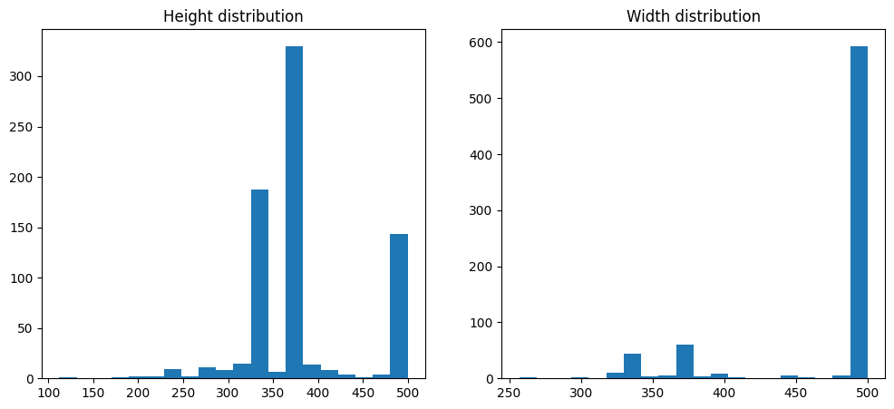

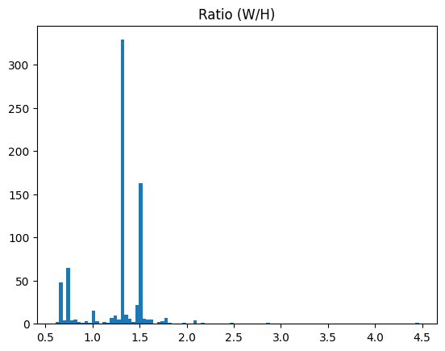

## Class Distribution
We will use the 20 labels used for the 20 object classes in the PASCAL VOC dataset. We can view the distribution for these classes in our training set.

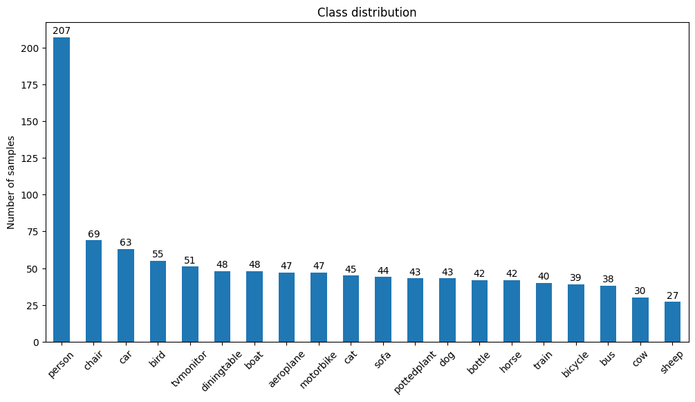

Some images in our training set have several labels associated with them.

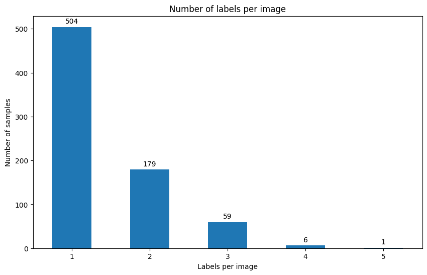

## Class Co-occurrence
Finally, we can view the co-occurrence matrix for our label set.

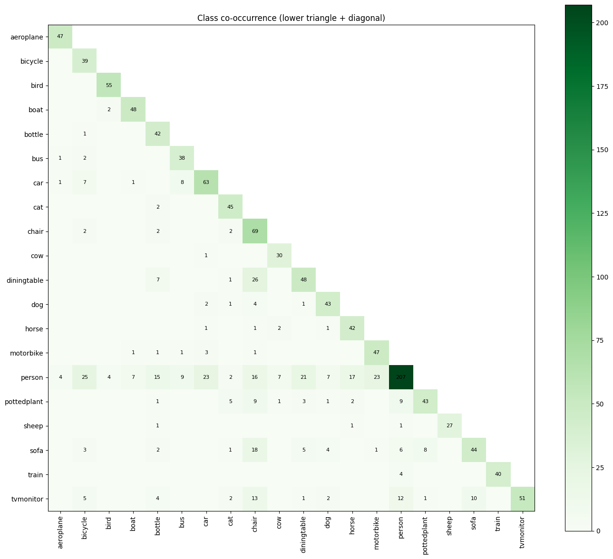

# 3. Semantic Segmentation

**Performance Metric:**
We evaluate our segmentation models using the mean Intersection over Union (mIoU) and Pixel Accuracy. While Pixel Accuracy provides a general sense of correctly classified area, mIoU is a more robust metric for segmentation as it accounts for the spatial overlap between the predicted mask and the ground truth. By averaging the IoU across all classes, we ensure that smaller objects (like bicycles or birds) are given equal importance to larger, more frequent classes like "background."

**Loss/Criterion:**
Since the task requires assigning a specific class to every individual pixel, we initially utilize Cross-Entropy (CE) Loss. This treats the segmentation problem as a dense pixel-wise classification task, where the loss is calculated for every pixel coordinate and averaged across the entire image dimensions to guide the model toward correct category identification.

**Preprocessing:**
Similar to the classification task, the images in the dataset vary in size. To facilitate batch training, we implement a preprocessing pipeline that handles resizing and normalization. For the final evaluation, however, we process images at their native resolution to avoid interpolation artifacts and preserve the fine structural details of the object boundaries.

**Config:**
Implementations are handled via the torch module, utilizing torch.utils.data.DataLoader for batch management. We use a custom Dataset class to manage image-mask pairs, ensuring that any spatial transformations (like cropping or flipping) are applied identically to both the input image and the target segmentation map to maintain spatial alignment.

## 3.1. Initial DeepLab Model
We go straight for a DeepLabV3 approach here, introduced by [Chen et al (2017), *Rethinking Atrous Convolution for Semantic Image Segmentation*](https://arxiv.org/abs/1706.05587). Semantic segmentation differs from classification as it is a dense prediction task, meaning for each pixel in the input image, we must output a class for that pixel, i.e. output is the same size as the input. DeepLabV3 excels at performing semantic segmentation as it is great at handling objects of different sizes, especially when compared to U-Net.

U-Net relies on downsampling and then upsampling the image. When downsampling, resolution decreases, but receptive field increases. While U-Net makes use of skip connections to preserve spatial details, it can struggle with multi-scale context.

DeepLab uses two techniques that help it overcome these flaws:
1. Dilation: Leaving pixels in between the mask e.g. instead of 3x3 adjacent pixels, it looks at 5x5, with the 2nd and 4th rows and columns not considered. This gives it more context without extra GPU work.
2. Atrous Spatial Pyramid Pooling (ASPP): Looks at each image region with different levels of zoom, then combines the views, allowing e.g. a person to be identified whether near (big) or far (small). This helps DeepLab beat U-Net in terms of multi-scale context.

### DeepLab Dataset
We begin with our Dataset class, similar to our previous Dataset class. Images passed to the DeepLab network must be normalised using mean and standard deviations computed from the ImageNet dataset that was used to pretrain the backbone. This is mentioned at https://pytorch.org/hub/pytorch_vision_deeplabv3_resnet101/.<br>

#### Improvement: Image Augmentations
When training, we perform three augmentations that act as regularisation - [Random Resized Crop (RRC)](https://docs.pytorch.org/vision/main/generated/torchvision.transforms.RandomResizedCrop.html#randomresizedcrop), [Colour Jitter](https://docs.pytorch.org/vision/main/generated/torchvision.transforms.ColorJitter.html#colorjitter), and random flipping. The first randomly crops the image in the scale range given, the second alters the image via slight brightness, contrast and saturation changes, and the last randomly flips images half the time. This increases the number of images we train on, so that each epoch, the model sees a slightly different version of the image. 

Given our training set is relatively small (749 images), these augmentations are particularly important for preventing the model from memorising specific images rather than learning the underlying segmentation task. This regularises the model and helps prevent the model from learning the specific image instead of the segmentation task.

When not training, images are preprocessed without any of this augmentation.

### Weights
We load DeepLabV3 without the pretrained weights. Although these weights weren't trained directly on PASCAL VOC images, they were trained on COCO to predict the same classes — since we can't verify there's no image overlap between COCO's training set and our test set, we omit them to avoid potential leakage.

### Training
We have three separate fitting stages: 
1. Linear fit: We train the classifier head only, freezing the backbone (10 epochs)
2. Partial finetuning: We unfreeze the last layer of the backbone with a lower learning rate to allow the model to learn more from our training images (20 epochs)
3. Full fitting: We unfreeze the entire model with an even lower learning rate to allow the network to slightly adjust its weights based on our training images (30 epochs)
The number of epochs increases for each stage while the learning rate decreases, since more epochs are required for convergence when learning rate is decreased.

#### Loss Function
We initially use Cross-Entropy Loss as our loss function, which checks each pixel individually to check whether it belongs to the right class.

$$
\mathcal{L}_{\text{CE}} = - \frac{1}{N} \sum_{i=1}^{N} \sum_{c=1}^{C} y_{i,c} \log(\hat{p}_{i,c})
$$

Where:
* $N$ is the total number of valid pixels in the image (excluding boundary pixels where $\text{target} = 255$)
* $C$ is the total number of classes
* $y_{i,c}$ is a binary indicator ($0$ or $1$) showing if class $c$ is the correct classification for pixel $i$
* $\hat{p}_{i,c}$ is the predicted probability (after the softmax layer) that pixel $i$ belongs to class $c$

#### Improvement: Optimiser & Scheduler
We use the ADAM optimiser instead of SGD for faster convergence, with the [PolyLR](https://docs.pytorch.org/docs/2.11/generated/torch.optim.lr_scheduler.PolynomialLR.html) learning rate scheduler to provide a smooth cooldown for the learning rate, preventing the weights from suddenly shaking at the end of training.<br>

We also apply Weight Decay here, ensuring that our weights do not grow too large.

#### Improvement: Batch Size
We train on batch size 4 for stable gradients, but this means we lose information for images that are larger than 256x256, our chosen dimensions, as all images in a batch must match in dimension. For the validation and test images we use a batch size of 1. This means we no longer have to resize these images, and since our network is able to understand objects at different scales, we can get much sharper masks for these images than if we were to also resize them.

### Prediction
#### Improvement: Test-Time Augmentation
We perform flips and multi-scale test-time augmentation (TTA) at prediction time. Each test image is processed at three different spatial scales (0.75x, 1.0x, 1.25x), with each scale also undergoing a horizontal flip. This results in a total of 6 forward passes per image. We aggregate these predictions by summing the softmax probability maps from all 6 passes and then applying an Argmax to determine the final pixel labels. This approach helps the model overcome sensitivity to object scale and orientation, which are common limitations in segmentation architectures. By averaging the probabilities rather than raw outputs, we produce a more stable and "voted-on" prediction.

### Dataset Loading
We load the datasets with shuffling on for the train dataset, and off for the validation dataset, to avoid the model learning the order of the data, but when predicting, this is not an issue.

### Improvement: Model Saving
We save the model weights from the best run, alongside the metrics printed during training (validation loss, mIoU etc). If we are not retraining our model, we simply load this information into our segmenter, and it loads the weights and the model's training history, avoiding GPU wastage from unnecessary training.

### Training Run
We output, in order:
1. Epoch number
2. Training loss
3. Validation loss
4. Mean Intersection-over-Union
5. Pixel accuracy (of the segmentation)
6. Learning rate
```
Stage: fit_linear
Epoch 01 | Train: 1.0359 | Val: 0.4892 | mIoU: 0.3160 | PixAcc: 0.8584 | LR: 9.59e-04
Best model saved: mIoU = 0.3160
Epoch 02 | Train: 0.6427 | Val: 0.4181 | mIoU: 0.3158 | PixAcc: 0.8598 | LR: 9.15e-04
Epoch 03 | Train: 0.5618 | Val: 0.3850 | mIoU: 0.4442 | PixAcc: 0.8758 | LR: 8.67e-04
Best model saved: mIoU = 0.4442
Epoch 04 | Train: 0.4827 | Val: 0.3600 | mIoU: 0.4391 | PixAcc: 0.8817 | LR: 8.15e-04
Epoch 05 | Train: 0.4586 | Val: 0.3119 | mIoU: 0.4872 | PixAcc: 0.8951 | LR: 7.58e-04
Best model saved: mIoU = 0.4872
Epoch 06 | Train: 0.4068 | Val: 0.3080 | mIoU: 0.4932 | PixAcc: 0.8967 | LR: 6.93e-04
Best model saved: mIoU = 0.4932
Epoch 07 | Train: 0.3676 | Val: 0.3109 | mIoU: 0.4915 | PixAcc: 0.8979 | LR: 6.18e-04
Epoch 08 | Train: 0.3524 | Val: 0.3136 | mIoU: 0.4893 | PixAcc: 0.8948 | LR: 5.25e-04
Epoch 09 | Train: 0.3139 | Val: 0.2883 | mIoU: 0.5132 | PixAcc: 0.9025 | LR: 3.98e-04
Best model saved: mIoU = 0.5132
Epoch 10 | Train: 0.2786 | Val: 0.2909 | mIoU: 0.5355 | PixAcc: 0.9003 | LR: 0.00e+00
Best model saved: mIoU = 0.5355
--------------------------------------------------
Stage: fit_finetune_partial
Epoch 01 | Train: 0.3194 | Val: 0.3255 | mIoU: 0.5136 | PixAcc: 0.8936 | LR: 9.80e-05
Epoch 02 | Train: 0.2697 | Val: 0.2834 | mIoU: 0.5465 | PixAcc: 0.9052 | LR: 9.59e-05
Best model saved: mIoU = 0.5465
Epoch 03 | Train: 0.2379 | Val: 0.2804 | mIoU: 0.5320 | PixAcc: 0.9086 | LR: 9.37e-05
Epoch 04 | Train: 0.2120 | Val: 0.2610 | mIoU: 0.5574 | PixAcc: 0.9137 | LR: 9.15e-05
Best model saved: mIoU = 0.5574
Epoch 05 | Train: 0.1915 | Val: 0.2923 | mIoU: 0.5375 | PixAcc: 0.9067 | LR: 8.91e-05
Epoch 06 | Train: 0.1716 | Val: 0.2783 | mIoU: 0.5689 | PixAcc: 0.9075 | LR: 8.67e-05
Best model saved: mIoU = 0.5689
Epoch 07 | Train: 0.1673 | Val: 0.2875 | mIoU: 0.5771 | PixAcc: 0.9102 | LR: 8.42e-05
Best model saved: mIoU = 0.5771
Epoch 08 | Train: 0.1508 | Val: 0.2635 | mIoU: 0.5962 | PixAcc: 0.9188 | LR: 8.15e-05
Best model saved: mIoU = 0.5962
Epoch 09 | Train: 0.1450 | Val: 0.2713 | mIoU: 0.5860 | PixAcc: 0.9147 | LR: 7.87e-05
Epoch 10 | Train: 0.1298 | Val: 0.2888 | mIoU: 0.5955 | PixAcc: 0.9118 | LR: 7.58e-05
Epoch 11 | Train: 0.1258 | Val: 0.2726 | mIoU: 0.5986 | PixAcc: 0.9182 | LR: 7.27e-05
Best model saved: mIoU = 0.5986
Epoch 12 | Train: 0.1235 | Val: 0.2491 | mIoU: 0.6139 | PixAcc: 0.9176 | LR: 6.93e-05
Best model saved: mIoU = 0.6139
Epoch 13 | Train: 0.1141 | Val: 0.2758 | mIoU: 0.5825 | PixAcc: 0.9097 | LR: 6.57e-05
Epoch 14 | Train: 0.1059 | Val: 0.2607 | mIoU: 0.6047 | PixAcc: 0.9205 | LR: 6.18e-05
Epoch 15 | Train: 0.1034 | Val: 0.2852 | mIoU: 0.5771 | PixAcc: 0.9150 | LR: 5.74e-05
Epoch 16 | Train: 0.0981 | Val: 0.2735 | mIoU: 0.5973 | PixAcc: 0.9154 | LR: 5.25e-05
Epoch 17 | Train: 0.1016 | Val: 0.2828 | mIoU: 0.5880 | PixAcc: 0.9153 | LR: 4.68e-05
Epoch 18 | Train: 0.0987 | Val: 0.2704 | mIoU: 0.5973 | PixAcc: 0.9178 | LR: 3.98e-05
Epoch 19 | Train: 0.0899 | Val: 0.2851 | mIoU: 0.5948 | PixAcc: 0.9183 | LR: 3.02e-05
Epoch 20 | Train: 0.0870 | Val: 0.2672 | mIoU: 0.6126 | PixAcc: 0.9187 | LR: 0.00e+00
--------------------------------------------------
Stage: fit
Epoch 01 | Train: 0.1147 | Val: 0.2509 | mIoU: 0.6159 | PixAcc: 0.9204 | LR: 9.87e-06
Best model saved: mIoU = 0.6159
Epoch 02 | Train: 0.1054 | Val: 0.2598 | mIoU: 0.6052 | PixAcc: 0.9184 | LR: 9.73e-06
Epoch 03 | Train: 0.0963 | Val: 0.2498 | mIoU: 0.6047 | PixAcc: 0.9215 | LR: 9.59e-06
Epoch 04 | Train: 0.0942 | Val: 0.2530 | mIoU: 0.6024 | PixAcc: 0.9195 | LR: 9.44e-06
Epoch 05 | Train: 0.0891 | Val: 0.2569 | mIoU: 0.5930 | PixAcc: 0.9205 | LR: 9.30e-06
Epoch 06 | Train: 0.0867 | Val: 0.2494 | mIoU: 0.6129 | PixAcc: 0.9214 | LR: 9.15e-06
Epoch 07 | Train: 0.0876 | Val: 0.2475 | mIoU: 0.6129 | PixAcc: 0.9262 | LR: 8.99e-06
Epoch 08 | Train: 0.0802 | Val: 0.2514 | mIoU: 0.6062 | PixAcc: 0.9236 | LR: 8.83e-06
Epoch 09 | Train: 0.0836 | Val: 0.2606 | mIoU: 0.6020 | PixAcc: 0.9219 | LR: 8.67e-06
Epoch 10 | Train: 0.0762 | Val: 0.2620 | mIoU: 0.5992 | PixAcc: 0.9231 | LR: 8.50e-06
Epoch 11 | Train: 0.0774 | Val: 0.2573 | mIoU: 0.6106 | PixAcc: 0.9241 | LR: 8.33e-06
Epoch 12 | Train: 0.0764 | Val: 0.2469 | mIoU: 0.6130 | PixAcc: 0.9248 | LR: 8.15e-06
Epoch 13 | Train: 0.0720 | Val: 0.2643 | mIoU: 0.6069 | PixAcc: 0.9218 | LR: 7.97e-06
Epoch 14 | Train: 0.0718 | Val: 0.2694 | mIoU: 0.5976 | PixAcc: 0.9229 | LR: 7.78e-06
Epoch 15 | Train: 0.0713 | Val: 0.2561 | mIoU: 0.6160 | PixAcc: 0.9249 | LR: 7.58e-06
Best model saved: mIoU = 0.6160
Epoch 16 | Train: 0.0749 | Val: 0.2682 | mIoU: 0.5977 | PixAcc: 0.9208 | LR: 7.37e-06
Epoch 17 | Train: 0.0710 | Val: 0.2624 | mIoU: 0.6053 | PixAcc: 0.9241 | LR: 7.16e-06
Epoch 18 | Train: 0.0702 | Val: 0.2671 | mIoU: 0.6013 | PixAcc: 0.9234 | LR: 6.93e-06
Epoch 19 | Train: 0.0680 | Val: 0.2593 | mIoU: 0.6161 | PixAcc: 0.9241 | LR: 6.69e-06
Best model saved: mIoU = 0.6161
Epoch 20 | Train: 0.0668 | Val: 0.2637 | mIoU: 0.6093 | PixAcc: 0.9248 | LR: 6.44e-06
Epoch 21 | Train: 0.0656 | Val: 0.2700 | mIoU: 0.6021 | PixAcc: 0.9220 | LR: 6.18e-06
Epoch 22 | Train: 0.0645 | Val: 0.2678 | mIoU: 0.5920 | PixAcc: 0.9228 | LR: 5.89e-06
Epoch 23 | Train: 0.0678 | Val: 0.2536 | mIoU: 0.6149 | PixAcc: 0.9253 | LR: 5.59e-06
Epoch 24 | Train: 0.0671 | Val: 0.2591 | mIoU: 0.6125 | PixAcc: 0.9251 | LR: 5.25e-06
Epoch 25 | Train: 0.0637 | Val: 0.2700 | mIoU: 0.5983 | PixAcc: 0.9248 | LR: 4.88e-06
Epoch 26 | Train: 0.0634 | Val: 0.2721 | mIoU: 0.6062 | PixAcc: 0.9223 | LR: 4.47e-06
Epoch 27 | Train: 0.0620 | Val: 0.2693 | mIoU: 0.6072 | PixAcc: 0.9256 | LR: 3.98e-06
Epoch 28 | Train: 0.0621 | Val: 0.2665 | mIoU: 0.6069 | PixAcc: 0.9240 | LR: 3.39e-06
Epoch 29 | Train: 0.0658 | Val: 0.2708 | mIoU: 0.6064 | PixAcc: 0.9247 | LR: 2.57e-06
Epoch 30 | Train: 0.0617 | Val: 0.2748 | mIoU: 0.6039 | PixAcc: 0.9240 | LR: 0.00e+00
--------------------------------------------------
Model and history saved to deeplab_best_model.pth, best mIoU: 0.6161
```

### Analysis
We see that our model clearly converges and begins to plateau with a peak mIoU of 0.6161 occurring at epoch 19 of the third stage. We also see that Epoch 1 of the third stage had an mIoU of 0.6159 — only 0.0002 lower than this eventual peak — so the model had likely already converged by the start of this stage, with mIoU fluctuating within a narrow band for the remainder of training.

Our validation loss clearly decreases, and then plateaus, but we can view the interplay between mIoU, training loss, and validation loss with some plots.

### Stage Plots

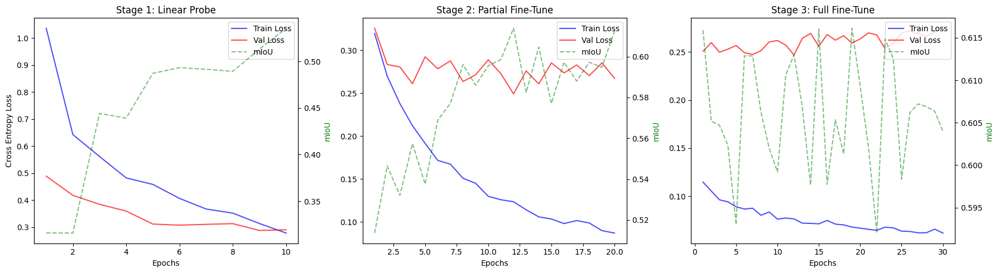

On the left y-axis, we have the Cross-Entropy Loss values, and on the right y-axis we have the mIoU values. On the x-axis is the number of epochs we run in each stage.
#### Stage 1: Linear Probe
We see mIoU shoot up, while training and validation loss go down, as expected when fitting the new classifier head. It learns the classes we want to output, and thus mIoU increases greatly as it correctly classifies more and more pixels.
#### Stage 2: Partial Fine-Tune
Here, we note the change in x- and y-axis scales. For the first stage, our left y-axis values ranged from 0.00 to ~1.10, while here the range was from ~0.05 to ~0.35. In this stage, the training loss curve maintains its shape, suggesting a decline in the training loss' gradient, which is again expected, as training loss tends to follow this exponential decay curve. 

Validation loss here seems to begin to plateau, fluctuating between 0.25 to 0.30. We do not see any major increases in validation loss here, which suggests we aren't yet overfitting.

We also note that mIoU continues to steadily increase, though appears to fluctuate more now. This, again, is due to the change in scale, where the range previously was from 0.30 to ~0.55 in the first plot, while here they range from ~0.51 to ~0.62, a much smaller range, hence fluctuations seem slightly larger now. We also run twice as many epochs in this stage compared to the previous, so more fluctuations are expected.

#### Stage 3: Full Fine-Tune
Our final stage runs for 30 epochs, and has even more fine-grained y-axes. Our training loss continues to decline at a much lower rate, as now the left y-axis range is ~0.05 to ~0.30 and our training loss is moving very slowly, beginning to plateau.

Our validation loss remains somewhat higher than our training loss, plateauing here around ~0.25. Critically, we notice the validation loss does not begin to increase by the time we take our best weights from this model, at Epoch 19, as this would suggest overfitting.

Finally, our mIoU appears to vary wildly in this section, but this is simply due to the range of the y-axis scale here, which ranges from ~0.590 to ~0.620. All variations of mIoU in this last stage are within this small range of 0.03, which is exaggerated by the scale.

We can view this more clearly if we combine all three stages onto one singular plot.

### Overall Analysis

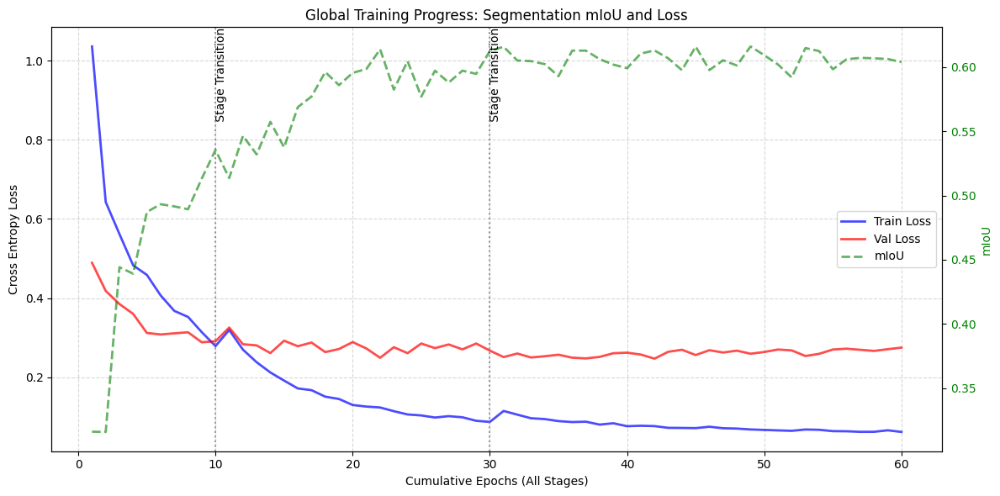

Now we plot all 60 epochs on one graph. Again, the left y-axis represents Cross-Entropy Loss, the right y-axis represents the mIoU, and the x-axis represents the cumulative epochs across all stages.

#### Training Loss
Our training loss begins high, exponentially decays, and begins to plateau, mainly in the third stage, at a low of ~0.06, meaning our model has learned from training data very well.

#### Validation Loss
This loss begins much lower than the training loss, but decays much slower, eventually reaching a plateau for the entire third stage of training. The loss does not show a sign of increasing, which would be a key indicator of overfitting.

#### mIoU
Our mIoU rises quickly in the beginning, and begins to plateau in the last stage of training, showing that our model has converged and reached its limit.

### Segmentation Mask Plots
We can use this model to predict masks for our training images alongside the predictions for them made in the classification section.

We'll first plot the ground truth masks.

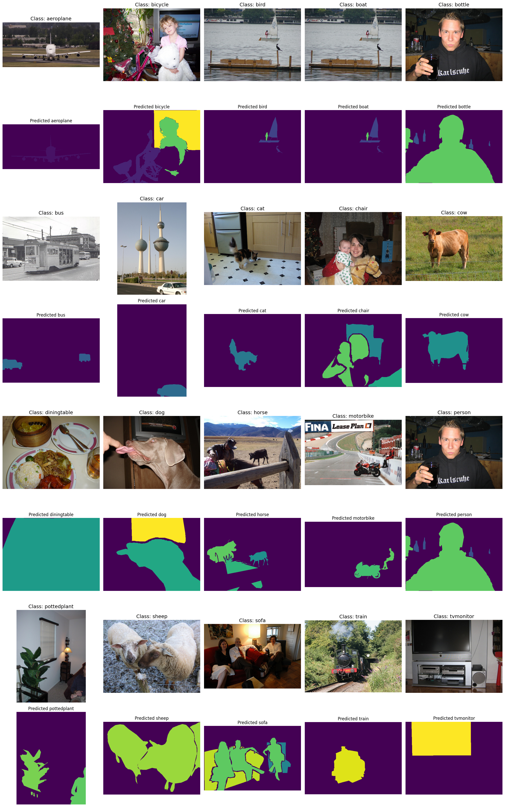

We can compare these with our predicted masks.

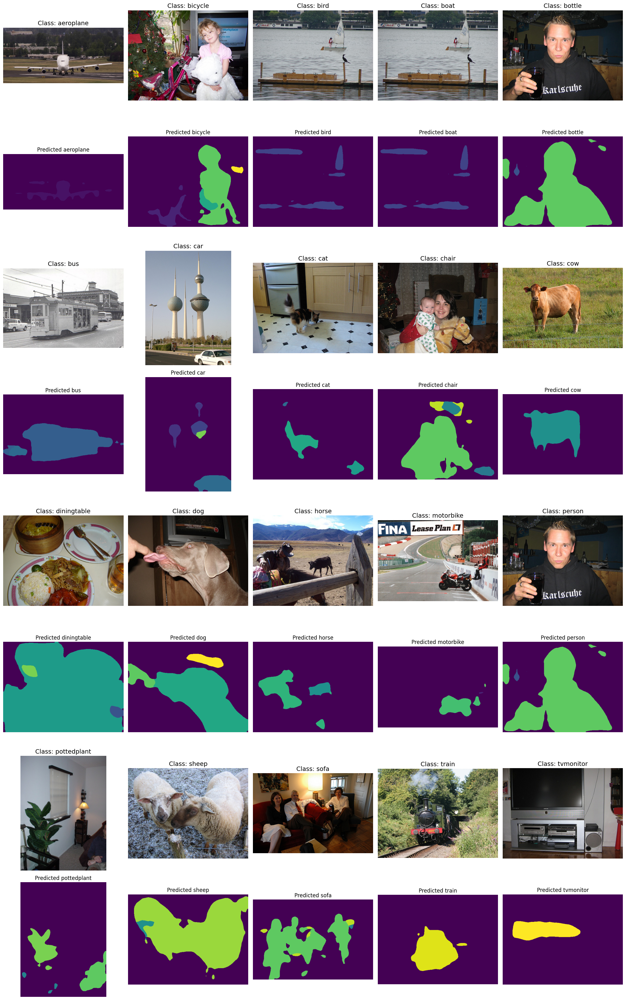

### Analysis
It's clear that our model has learned the task, evidenced by the accuracy of the segmentation masks.

Highlights include the cow, the dog, and the sheep. There are also cases where we struggle, such as the tvmonitor at the end, or the diningtable, where the objects on the table seem to influence the separation of the diningtable and the background, when it does not actually end there.

We note in particular that boundaries from our predictions appear somewhat smoother than in the ground truth. This smoother boundary is likely an architectural characteristic of DeepLabV3, possibly resulting from the dilation used within the model.

## 3.2. Improvement: Combo Loss
Cross-Entropy Loss works for segmentation as it considers each pixel individually, maximising the number of pixels that belong to the right class.<br>
However, this can backfire, especially when training data has a majority of pixels belonging to one main class e.g. background. Classifying every pixel as background can already produce relatively high pixel-level accuracy due to the dominance of the background class.

Dice loss, introduced by [Milletari et al (2016), *V-Net: Fully Convolutional Neural Networks for Volumetric Medical Image Segmentation*](https://arxiv.org/abs/1606.04797), leverages the Dice-Sørensen coefficient in semantic segmentation to act as a region-based loss, optimising spatial overlap between predicted segmentation masks and the ground truth. It is effective at mitigating this class imbalance.

$$\mathcal{L}_{\text{Dice}} = 1 - \frac{1}{C} \sum_{c=1}^{C} \frac{2 \sum_{i=1}^{N} y_{i,c} \hat{p}_{i,c} + \epsilon}{\sum_{i=1}^{N} y_{i,c} + \sum_{i=1}^{N} \hat{p}_{i,c} + \epsilon}$$

Where:
* $N$ and $C$ represent the valid pixels and classes respectively, matching the CE loss notation
* $y_{i,c}$ is the ground truth binary mask for class $c$ at pixel $i$
* $\hat{p}_{i,c}$ is the predicted softmax probability map for class $c$ at pixel $i$
* $\epsilon$ is a small smoothing factor added to prevent division-by-zero errors if a class is entirely missing from both the ground truth and the prediction

Rather than use this loss in isolation, we combine it with our [existing Cross-Entropy Loss](#loss-function). This is standard practice, as Cross-Entropy Loss optimises pixel-level classification accuracy, providing stable gradients for training. It only struggles with the class imbalance, which is where the Dice Loss excels, imposing a penalty that optimises for regional intersection-over-union (IoU). This hybrid approach forces the model to capture fine boundaries and rare, smaller classes the standard Cross-Entropy Loss would otherwise ignore. We'll combine these with equal weights:

$$\mathcal{L}_{\text{Total}} = 0.5\mathcal{L}_{\text{CE}} + 0.5\mathcal{L}_{\text{Dice}}$$

### Second Training Run

```
Stage: fit_linear
Epoch 01 | Train: 0.6064 | Val: 0.2705 | mIoU: 0.2930 | PixAcc: 0.8465 | LR: 9.59e-04
Best model saved: mIoU = 0.2930
Epoch 02 | Train: 0.3895 | Val: 0.2112 | mIoU: 0.4527 | PixAcc: 0.8827 | LR: 9.15e-04
Best model saved: mIoU = 0.4527
Epoch 03 | Train: 0.3444 | Val: 0.2195 | mIoU: 0.4499 | PixAcc: 0.8685 | LR: 8.67e-04
Epoch 04 | Train: 0.3176 | Val: 0.1817 | mIoU: 0.4753 | PixAcc: 0.8973 | LR: 8.15e-04
Best model saved: mIoU = 0.4753
Epoch 05 | Train: 0.2915 | Val: 0.1887 | mIoU: 0.4758 | PixAcc: 0.8889 | LR: 7.58e-04
Best model saved: mIoU = 0.4758
Epoch 06 | Train: 0.2560 | Val: 0.1891 | mIoU: 0.5219 | PixAcc: 0.8894 | LR: 6.93e-04
Best model saved: mIoU = 0.5219
Epoch 07 | Train: 0.2426 | Val: 0.1777 | mIoU: 0.4976 | PixAcc: 0.8957 | LR: 6.18e-04
Epoch 08 | Train: 0.2238 | Val: 0.1852 | mIoU: 0.5041 | PixAcc: 0.8877 | LR: 5.25e-04
Epoch 09 | Train: 0.2065 | Val: 0.2013 | mIoU: 0.5282 | PixAcc: 0.8803 | LR: 3.98e-04
Best model saved: mIoU = 0.5282
Epoch 10 | Train: 0.1890 | Val: 0.1715 | mIoU: 0.5247 | PixAcc: 0.9008 | LR: 0.00e+00
--------------------------------------------------
Stage: fit_finetune_partial
Epoch 01 | Train: 0.2153 | Val: 0.1812 | mIoU: 0.5346 | PixAcc: 0.8919 | LR: 9.80e-05
Best model saved: mIoU = 0.5346
Epoch 02 | Train: 0.1851 | Val: 0.1701 | mIoU: 0.5406 | PixAcc: 0.9019 | LR: 9.59e-05
Best model saved: mIoU = 0.5406
Epoch 03 | Train: 0.1631 | Val: 0.1477 | mIoU: 0.5679 | PixAcc: 0.9162 | LR: 9.37e-05
Best model saved: mIoU = 0.5679
Epoch 04 | Train: 0.1486 | Val: 0.1686 | mIoU: 0.5607 | PixAcc: 0.9029 | LR: 9.15e-05
Epoch 05 | Train: 0.1309 | Val: 0.1594 | mIoU: 0.5679 | PixAcc: 0.9071 | LR: 8.91e-05
Best model saved: mIoU = 0.5679
Epoch 06 | Train: 0.1156 | Val: 0.1600 | mIoU: 0.5698 | PixAcc: 0.9129 | LR: 8.67e-05
Best model saved: mIoU = 0.5698
Epoch 07 | Train: 0.1106 | Val: 0.1408 | mIoU: 0.5936 | PixAcc: 0.9207 | LR: 8.42e-05
Best model saved: mIoU = 0.5936
Epoch 08 | Train: 0.1062 | Val: 0.1490 | mIoU: 0.5911 | PixAcc: 0.9241 | LR: 8.15e-05
Epoch 09 | Train: 0.0991 | Val: 0.1494 | mIoU: 0.5931 | PixAcc: 0.9176 | LR: 7.87e-05
Epoch 10 | Train: 0.0949 | Val: 0.1475 | mIoU: 0.5989 | PixAcc: 0.9202 | LR: 7.58e-05
Best model saved: mIoU = 0.5989
Epoch 11 | Train: 0.0906 | Val: 0.1508 | mIoU: 0.5887 | PixAcc: 0.9204 | LR: 7.27e-05
Epoch 12 | Train: 0.0888 | Val: 0.1445 | mIoU: 0.5942 | PixAcc: 0.9220 | LR: 6.93e-05
Epoch 13 | Train: 0.0793 | Val: 0.1536 | mIoU: 0.5798 | PixAcc: 0.9148 | LR: 6.57e-05
Epoch 14 | Train: 0.0783 | Val: 0.1444 | mIoU: 0.6085 | PixAcc: 0.9275 | LR: 6.18e-05
Best model saved: mIoU = 0.6085
Epoch 15 | Train: 0.0720 | Val: 0.1477 | mIoU: 0.6014 | PixAcc: 0.9256 | LR: 5.74e-05
Epoch 16 | Train: 0.0728 | Val: 0.1484 | mIoU: 0.6040 | PixAcc: 0.9244 | LR: 5.25e-05
Epoch 17 | Train: 0.0703 | Val: 0.1592 | mIoU: 0.5843 | PixAcc: 0.9199 | LR: 4.68e-05
Epoch 18 | Train: 0.0668 | Val: 0.1576 | mIoU: 0.5964 | PixAcc: 0.9191 | LR: 3.98e-05
Epoch 19 | Train: 0.0676 | Val: 0.1484 | mIoU: 0.6035 | PixAcc: 0.9239 | LR: 3.02e-05
Epoch 20 | Train: 0.0651 | Val: 0.1493 | mIoU: 0.6065 | PixAcc: 0.9246 | LR: 0.00e+00
--------------------------------------------------
Stage: fit
Epoch 01 | Train: 0.0732 | Val: 0.1407 | mIoU: 0.6094 | PixAcc: 0.9263 | LR: 9.87e-06
Best model saved: mIoU = 0.6094
Epoch 02 | Train: 0.0669 | Val: 0.1432 | mIoU: 0.6069 | PixAcc: 0.9250 | LR: 9.73e-06
Epoch 03 | Train: 0.0665 | Val: 0.1430 | mIoU: 0.6020 | PixAcc: 0.9256 | LR: 9.59e-06
Epoch 04 | Train: 0.0639 | Val: 0.1458 | mIoU: 0.6026 | PixAcc: 0.9260 | LR: 9.44e-06
Epoch 05 | Train: 0.0644 | Val: 0.1471 | mIoU: 0.6047 | PixAcc: 0.9235 | LR: 9.30e-06
Epoch 06 | Train: 0.0624 | Val: 0.1492 | mIoU: 0.6055 | PixAcc: 0.9267 | LR: 9.15e-06
Epoch 07 | Train: 0.0609 | Val: 0.1482 | mIoU: 0.6061 | PixAcc: 0.9274 | LR: 8.99e-06
Epoch 08 | Train: 0.0588 | Val: 0.1456 | mIoU: 0.6024 | PixAcc: 0.9256 | LR: 8.83e-06
Epoch 09 | Train: 0.0568 | Val: 0.1434 | mIoU: 0.6138 | PixAcc: 0.9273 | LR: 8.67e-06
Best model saved: mIoU = 0.6138
Epoch 10 | Train: 0.0582 | Val: 0.1444 | mIoU: 0.6086 | PixAcc: 0.9259 | LR: 8.50e-06
Epoch 11 | Train: 0.0555 | Val: 0.1460 | mIoU: 0.6149 | PixAcc: 0.9273 | LR: 8.33e-06
Best model saved: mIoU = 0.6149
Epoch 12 | Train: 0.0560 | Val: 0.1456 | mIoU: 0.6132 | PixAcc: 0.9276 | LR: 8.15e-06
Epoch 13 | Train: 0.0524 | Val: 0.1489 | mIoU: 0.6091 | PixAcc: 0.9279 | LR: 7.97e-06
Epoch 14 | Train: 0.0531 | Val: 0.1466 | mIoU: 0.6153 | PixAcc: 0.9279 | LR: 7.78e-06
Best model saved: mIoU = 0.6153
Epoch 15 | Train: 0.0535 | Val: 0.1490 | mIoU: 0.6083 | PixAcc: 0.9272 | LR: 7.58e-06
Epoch 16 | Train: 0.0531 | Val: 0.1478 | mIoU: 0.6108 | PixAcc: 0.9277 | LR: 7.37e-06
Epoch 17 | Train: 0.0526 | Val: 0.1453 | mIoU: 0.6157 | PixAcc: 0.9287 | LR: 7.16e-06
Best model saved: mIoU = 0.6157
Epoch 18 | Train: 0.0512 | Val: 0.1480 | mIoU: 0.6091 | PixAcc: 0.9275 | LR: 6.93e-06
Epoch 19 | Train: 0.0497 | Val: 0.1450 | mIoU: 0.6116 | PixAcc: 0.9286 | LR: 6.69e-06
Epoch 20 | Train: 0.0481 | Val: 0.1464 | mIoU: 0.6131 | PixAcc: 0.9280 | LR: 6.44e-06
Epoch 21 | Train: 0.0482 | Val: 0.1478 | mIoU: 0.6138 | PixAcc: 0.9280 | LR: 6.18e-06
Epoch 22 | Train: 0.0508 | Val: 0.1487 | mIoU: 0.6060 | PixAcc: 0.9266 | LR: 5.89e-06
Epoch 23 | Train: 0.0474 | Val: 0.1496 | mIoU: 0.6104 | PixAcc: 0.9274 | LR: 5.59e-06
Epoch 24 | Train: 0.0476 | Val: 0.1523 | mIoU: 0.6113 | PixAcc: 0.9273 | LR: 5.25e-06
Epoch 25 | Train: 0.0474 | Val: 0.1473 | mIoU: 0.6143 | PixAcc: 0.9290 | LR: 4.88e-06
Epoch 26 | Train: 0.0462 | Val: 0.1518 | mIoU: 0.6029 | PixAcc: 0.9273 | LR: 4.47e-06
Epoch 27 | Train: 0.0457 | Val: 0.1512 | mIoU: 0.6125 | PixAcc: 0.9281 | LR: 3.98e-06
Epoch 28 | Train: 0.0456 | Val: 0.1485 | mIoU: 0.6162 | PixAcc: 0.9285 | LR: 3.39e-06
Best model saved: mIoU = 0.6162
Epoch 29 | Train: 0.0452 | Val: 0.1504 | mIoU: 0.6164 | PixAcc: 0.9290 | LR: 2.57e-06
Best model saved: mIoU = 0.6164
Epoch 30 | Train: 0.0450 | Val: 0.1497 | mIoU: 0.6138 | PixAcc: 0.9291 | LR: 0.00e+00
--------------------------------------------------
Model and history saved to deeplab_best_combo_model.pth, best mIoU: 0.6164
```

### Analysis
Like the CE model, our model clearly converges and begins to plateau, this time with a very slightly higher peak mIoU of 0.6164 occurring at epoch 29 of the third stage. Here, Epoch 1 of the third stage had an mIoU of 0.6094, so the model seemed to lag behind the initial CE model, but eventually climbed slightly higher in mIoU.

Once again validation loss clearly decreases, and then plateaus, but we can view the interplay between mIoU, training loss, and validation loss with some plots.

### Stage Plots

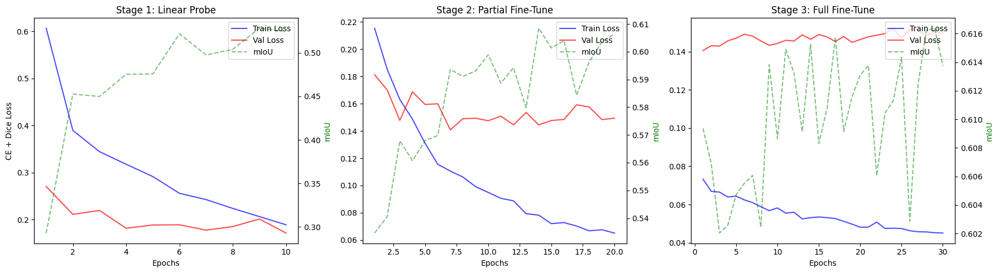

On the left y-axis, we have the Combo Loss values, and on the right y-axis we have the mIoU values. On the x-axis is the number of epochs we run in each stage.

#### Stage 1: Linear Probe
We once again see mIoU shoot up, while training and validation loss go down, as expected when fitting the new classifier head. It learns the classes we want to output, and thus mIoU increases greatly as it correctly classifies more and more pixels.

#### Stage 2: Partial Fine-Tune
Here, we note the change in x- and y-axis scales. For the first stage, our left y-axis values ranged from ~0.10 to ~0.60, while here the range is from 0.06 to 0.22. In this stage, the training loss curve maintains its shape, suggesting a decline in the training loss' gradient, which is again expected, as training loss tends to follow this exponential decay curve. 

Validation loss here seems to begin to plateau, but still appears to continue decreasing throughout this stage, with minor fluctuations.

We again note that mIoU continues to steadily increase, though appears to fluctuate more now. This is due to the change in scale, where the range previously was from ~0.28 to ~0.55 in the first plot, while here they range from ~0.53 to ~0.61, a much smaller range, hence fluctuations appear larger now. We also run twice as many epochs in this stage compared to the previous, so more fluctuations are expected.

#### Stage 3: Full Fine-Tune
Our final stage runs for 30 epochs, and has even more fine-grained y-axes. Our training loss continues to decline at a much lower rate, as now the range is 0.04 to ~0.16 and our training loss is moving very slowly, beginning to plateau.

Our validation loss remains higher than our training loss, plateauing here around 0.15. Critically, we notice the validation loss does not begin to increase by the time we take our best weights from this model, at Epoch 29, as this would suggest overfitting.

Finally, our mIoU appears to vary wildly in this section, but this is again due to the range of the y-axis scale here, which ranges from ~0.602 to ~0.617. All variations of mIoU in this last stage are within this small range of 0.015, which is exaggerated by the scale.

We can view this more clearly if we combine all three stages onto one singular plot.

### Overall Analysis

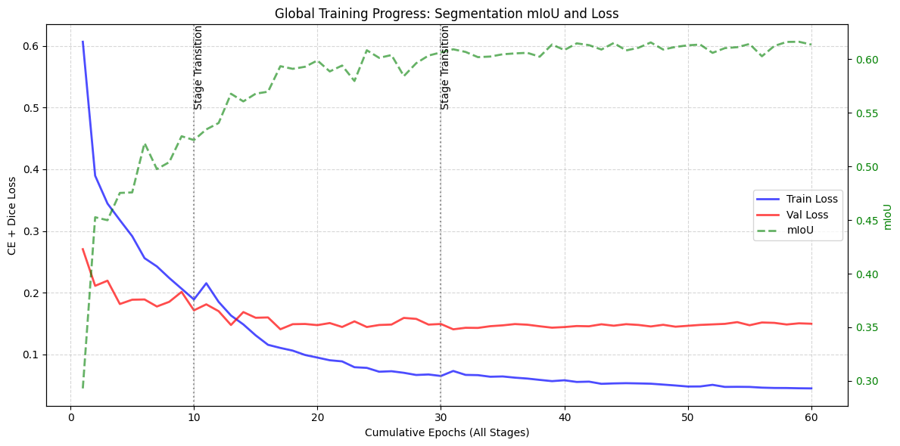

Now we plot all 60 epochs on one graph. Again, the left y-axis represents Combo Loss, the right y-axis represents the mIoU, and the x-axis represents the cumulative epochs across all stages.

#### Training Loss
Our training loss begins high, exponentially decays, and begins to plateau, mainly in the third stage, at a low of ~0.05, meaning our model has learned from training data very well.

#### Validation Loss
This loss begins much lower than the training loss, but decays much slower, eventually reaching a plateau for the entire third stage of training around ~0.15. The loss does not show a sign of increasing, which would be a key indicator of overfitting.

##### Improvement: Generalisation
Switching to a Combo Loss has helped our model generalise more. The loss values themselves are directly incomparable since they have different domains, with CE Loss's domain being $[0,\infty)$, and Dice Loss' domain being $[0,1]$. We can instead look at the ratio between the training loss and the validation loss.

In our CE Loss model, the ratio 

$$\frac{\text{val\\_loss}}{\text{train\\_loss}}$$

at the point we take our best weights shows us that the validation loss is ~3.81x the training loss (3rd Stage, Epoch 19 | Train: 0.0680, Val: 0.2593).

In our Combo Loss model, the ratio at the point we take our best weights shows us that the validation loss is ~3.33x the training loss (3rd Stage, Epoch 29 | Train: 0.0452, Val: 0.1504).

This relative tightening indicates that the Combo Loss acts as a global regulariser, mitigating the pixel-level overfitting typical of Cross-Entropy Loss, without significantly affecting the class-level predictions required to improve mIoU.

#### mIoU
Our mIoU rises quickly in the beginning, and begins to plateau in the last stage of training, showing that our model has converged and reached its limit.

### Segmentation Mask Plots
We can use this model to predict masks for our training images alongside the predictions for them made in the classification section.

We'll first plot the ground truth masks again.


We can compare these with our newly predicted masks.

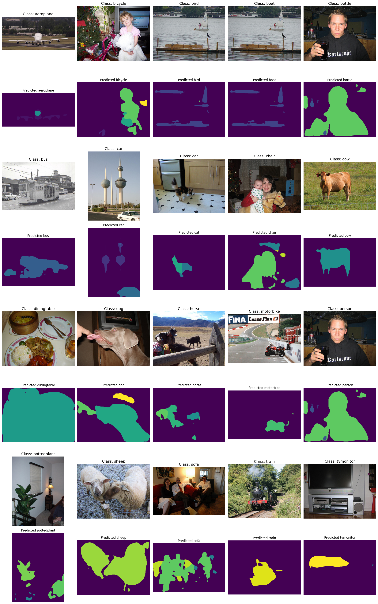

### Analysis
Once again, our model has learned the task, evidenced by the accuracy of the segmentation masks.

Here we can compare to the previous segmentation masks produced by our CE model. Despite both models sharing a similar peak mIoU, we do see improvements in the masks generated here.

#### Highlights
##### Sheep
A good example is the sheep on the bottom row, second column. In the CE Model, they almost appear as one continuous object. In this model, there is a clear boundary between the sheep, identifying them as two separate entities.
##### Sofa
People are sitting on the sofa in the bottom-centre image, next to the sheep. In the CE Model, we can make out their shapes, with high-frequency yellow pixel noise surrounding them. In this model, this yellow noise is more clearly revealed to be the sofa they are sitting on.

In general, there is a lot less noise in our improved model, with the flecks of random colours both outside and within objects largely diminished. While the mIoU increased only marginally with the different loss functions, the visual improvement shows that mIoU alone is not the only measure of improvement.

### Segmenting Test Data
Finally, we can plot some of our segmentation masks on the test data using our Combo Loss Model.

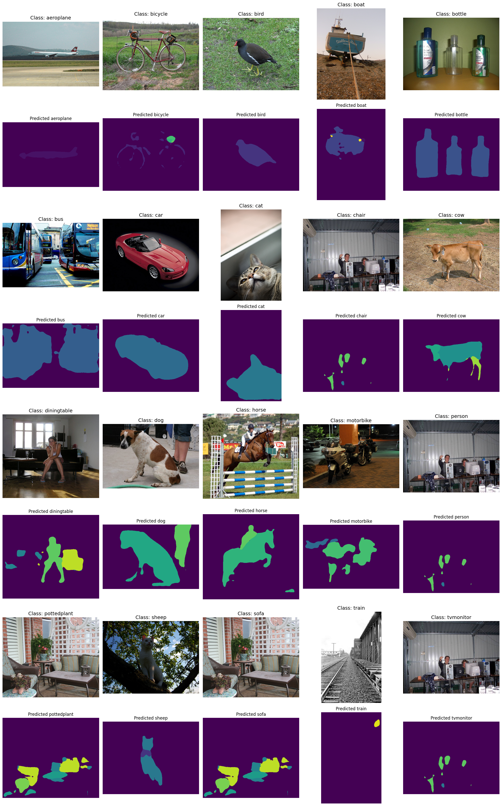

We can once again see that the segmentation task is understood. Highlights here include the bird, the car, the dog, and the jumping horse, which are all very clearly segmented.

The model is far from perfect, however, and it does struggle in some cases.
These tend to be:
- Images with a lot of background noise
    - e.g. the buses predicted (second row, first column). The model struggles to get the boundaries of the buses themselves, likely due to many similar colours on the windows and reflections.
- Images with small objects that need to be segmented
    - e.g. the bike predicted (first row, second column). The model struggles to get the entire bike in the mask, as seen by small gaps in the mask and varying width of the tyres, with the bottom of the tyres disappearing almost completely at the bottom.

# 4. Conclusion
The semantic segmentation task deepened our understanding of what it means to move "beyond classification". Classification asks, "what objects are present?", while segmentation requires answering "where exactly is each object, at the pixel level?", a much more difficult task.

The smoother boundaries in our predicted masks compared to the ground truth are a direct consequence of our architectural choice: DeepLabV3 uses dilation, which averages over a wider context than high-resolution skip connections would, producing cleaner but slightly less sharp boundaries.

The improvement from Cross-Entropy loss to Combo Loss (CE + Dice) also illustrated an important principle: the choice of loss function encodes assumptions about the data. CE loss treats every pixel equally, which means the dominant background class silently shapes the gradients. Dice loss directly optimizes spatial overlap and is inherently more robust to this imbalance. This relative tightening of the val/train loss ratio — from ~3.81x under CE to ~3.33x under Combo Loss — confirmed that the Dice component acts as a global regularizer.

Our model is, however, far from perfect, and tends to struggle with segmenting objects that occupy a small space. Dilation widens our receptive field, but can lead to sets of pixels being missed, meaning that thin objects may not be correctly segmented, as the network does not correctly recognize them when passing over the image. We also struggle with specular reflections, as segmentation relies heavily on local contextual features, meaning we can end up predicting background in the middle of an object.

Given more time on this project, an immediate first step would be to use our successful classification to aid in segmentation. By first checking the classes that our classifier predicts, we can perform better in semantic segmentation. As mentioned earlier, each pixel counts for segmentation, so we can simply check the classes predicted by the classifier and refuse to segment any classes other than those mentioned.

A hybrid search for our Combo Loss weighting would also likely prove fruitful. Our segmenter often spuriously predicts pixels, whether they are within an object or not, which is likely due to the Cross Entropy component of the loss, which considers individual pixels. It is possible that our model would perform better with a weight leaning more towards Dice Loss, as opposed to the equal weighting between Cross-Entropy and Dice Loss we use now.

Our current model is not ready for real-world deployment. We use test-time augmentation at prediction, meaning we perform 6 forward passes for each image, before aggregating the probabilities and making a prediction. In a real-time scenario, e.g. video editing, or autonomous driving systems, this latency is unacceptable. Stripping this TTA will reduce latency, but drop performance, meaning we have a trade-off between latency and performance. A potential move towards real-world performance here would be to use Knowledge Distillation. This teacher-student framework would allow a lighter, much faster model to learn the complex patterns that our heavy network has learnt and apply them much quicker than our current setup. A good example of a candidate student would be MobileNetV3.
